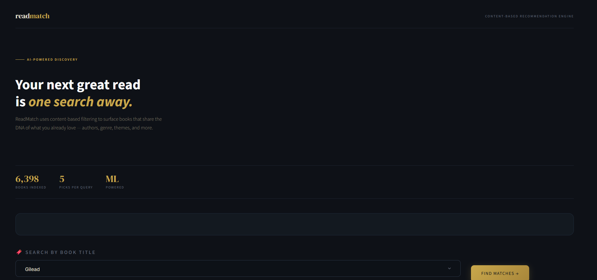
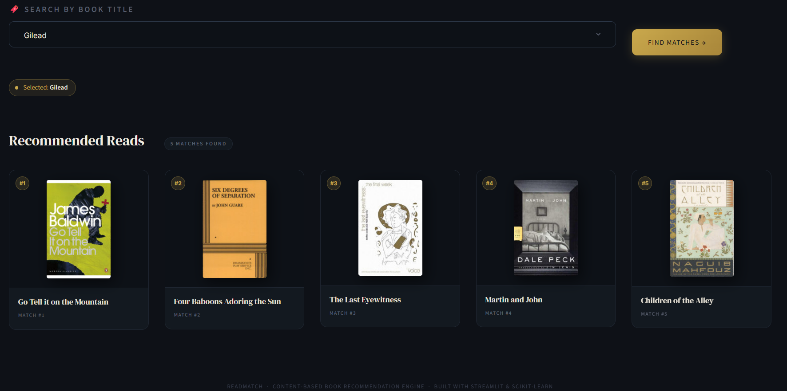

# 📚 ReadMatch - AI-Powered Book Recommendation Engine

<p align="left">
  
  
  
  
  
  
</p>

> **ReadMatch** is a content-based book recommendation system that surfaces five personalized book suggestions using NLP-driven similarity on a dataset of 6,800+ titles - deployed as an interactive Streamlit web application.

---

## 📸 Screenshots

| Hero & Search | Recommendations |
|---|---|
|  |  |

---

## 🧠 How It Works

ReadMatch implements a **content-based filtering** pipeline in three stages:

```
Raw Book Data  →  Feature Engineering (tags)  →  TF Vectorization  →  Cosine Similarity Matrix  →  Top-5 Results
```

1. **Tag Construction** - Each book's `title`, `authors`, `categories`, and `description` are concatenated into a single unified text feature (`tags`).
2. **Vectorization** - `CountVectorizer` (top 5,000 features, English stop words removed) converts tags into sparse numeric vectors.
3. **Similarity Scoring** - `cosine_similarity` computes pairwise similarity across all books. At query time, the top-5 most similar books (excluding the input) are returned instantly from the pre-computed matrix.

This approach means **zero latency at inference** - the similarity matrix is computed once at training time and serialized with `pickle`.

---

## 📂 Project Structure

```
readmatch-book-recommender/
├── app.py    # Streamlit frontend (UI + inference)
├── train.py  # Offline training pipeline
├── books.pkl                     # Serialized cleaned DataFrame
├── similarity.pkl               # Pre-computed cosine similarity matrix
├── books.xls                     # Raw dataset (CSV format, 6,800+ books)
├── requirements.txt              # Python dependencies
├── screenshots/
│   ├── hero_search.png           # Hero section & search bar
│   └── recommendations.png      # Results / book card grid
└── README.md
```

---

## 🛠️ Tech Stack

| Layer | Technology |
|---|---|
| **Language** | Python 3.10+ |
| **Web Framework** | Streamlit |
| **ML / NLP** | Scikit-learn (`CountVectorizer`, `cosine_similarity`) |
| **Data Processing** | Pandas |
| **Serialization** | Pickle |
| **UI Styling** | Custom CSS (Google Fonts, responsive layout) |

---

## ⚙️ Setup & Installation

### Prerequisites
- Python 3.10+
- pip

### 1. Clone the repository
```bash
git clone https://github.com/Chowdri-Furkhan07/readmatch-book-recommender.git
cd readmatch-book-recommender
```

### 2. Install dependencies
```bash
pip install -r requirements.txt
```

### 3. Run the training pipeline
> Skip this step if `books.pkl` and `similarity1.pkl` are already present in the repo.

```bash
python train.py
```

This generates two files:
- `books.pkl` - cleaned book metadata DataFrame
- `similarity1.pkl` - (6,800 × 6,800) cosine similarity matrix

### 4. Launch the app
```bash
streamlit run app.py
```

The app opens at `http://localhost:8501`.

---

## 📊 Dataset

The dataset (`books.xls`) contains **6,800+ books** with the following fields:

| Column | Description |
|---|---|
| `title` | Book title |
| `authors` | Author(s) |
| `categories` | Genre / category tags |
| `description` | Publisher description |
| `thumbnail` | Cover image URL |
| `average_rating` | Goodreads rating |
| `published_year` | Year of publication |
| `num_pages` | Page count |
| `ratings_count` | Number of Goodreads ratings |

---

## 🔍 Key Features

- **Content-Based Filtering** — recommendations derived purely from book metadata, no user history required
- **Instant Inference** — pre-computed similarity matrix ensures sub-second response time
- **Cover Art Display** — fetches and renders book covers via thumbnail URLs
- **Graceful Fallback** — displays a placeholder icon when cover images are unavailable
- **Responsive UI** — clean dark-theme interface with mobile-friendly column layout

---

## 🧩 Potential Enhancements

- [ ] Add collaborative filtering layer (user–item matrix) for hybrid recommendations
- [ ] Integrate a search-as-you-type autocomplete with fuzzy matching
- [ ] Deploy on Streamlit Cloud / Hugging Face Spaces with CI/CD
- [ ] Add author-based filtering and genre drill-down sidebar
- [ ] Replace `CountVectorizer` with TF-IDF or sentence embeddings (`sentence-transformers`) for richer semantics

---

## 👤 Author

**Chowdri Furkhan**

Artificial Intelligence & Machine Learning

<p>
  <a href="https://linkedin.com/in/chowdri-furkhan"></a>
  &nbsp;
  <a href="https://github.com/Chowdri-Furkhan07"></a>
</p>

---

## 📄 License

This project is licensed under the [MIT License](LICENSE).

---

<p align="center">
  <sub>Built with Python · Scikit-learn · Streamlit</sub>
</p>
